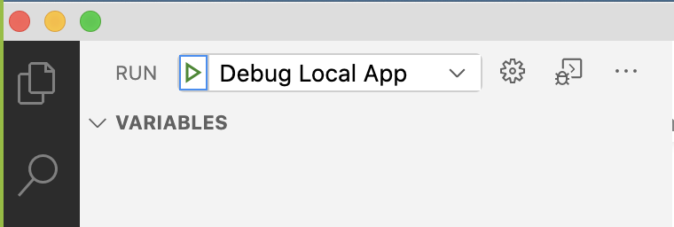
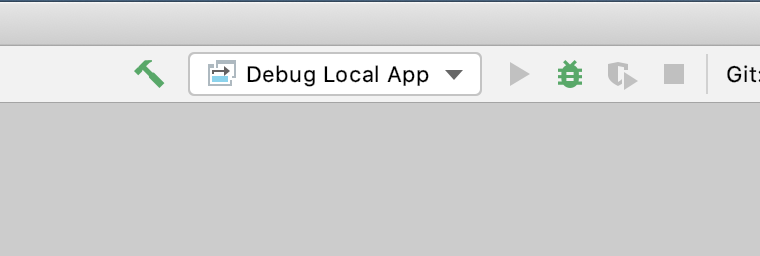

# Wahlzeit: Open Source Software for Photo Rating Sites


## Introduction

Wahlzeit is an open source web application that lets users upload photos and rate photos of other users on a 1..10 scale. Users get to present their best photos and learn what other users thought of theirs. 

Wahlzeit is used to teach agile methods and open source software development at the Professorship of Open Source Software at the Friedrich-Alexander-University of Erlangen-Nürnberg.

It is an easy-to-learn yet complete Java web application that is available under the GNU Affero Public License v3 license, see the [LICENSE.txt](/LICENSE.txt) file.

For more information, please see http://github.com/dirkriehle/wahlzeit and http://osr.cs.fau.de.

## Wahlzeit Setup

- Install **Java JDK** 8 or higher. We recommended you to use Java JDK 11.
- An easy way to manage Java JDKs and JREs is by using [SDKMAN](https://sdkman.io/). With SDKMAN you can install the Java SDK with the following command:
 `sdk install java 11.0.8.j9-adpt`
- Ensure `java -version` can be executed from the command line.
- [optional] Install [Docker](https://docs.docker.com/get-docker/) and [Docker Compose](https://docs.docker.com/compose/install/) to use the container deployment option.
- Create your own repository by forking Wahlzeit from **dirkriehle** to your GitHub-account.

**Windows user have to clone the repository with the following command; otherwise it will cause problems during the Docker build:**

`git clone YOUR_URL --config core.autocrlf=input`

### PostgreSQL Database

Wahlzeit stores its data in a PostgreSQL database. Therefore, an PostgreSQL instance need to be reachable if you start Wahlzeit.

The easiest way to run a PostgreSQL instance is via `Docker` and `Docker Compose`.

With `docker-compose up db adminer` you can start PostgreSQL as Docker container. It will also start Adminer which is a simple database management ui. It allows you to query the database and alter tables within the database. You can access the ui via 
[http://localhost:8090/](http://localhost:8090/).

If you run a PostgreSQL without the preset Docker image ensure that the your instance has the following settings: 
```
POSTGRES_DB: wahlzeit
POSTGRES_USER: wahlzeit
POSTGRES_PASSWORD: wahlzeit
```
## How to Use

### Build and Run

Before you can start Wahlzeit a PostgreSQL instance need to be reachable (see above).

To build and run Wahlzeit you can use `./gradlew appRun` (on Windows: `gradlew.bat appRun`). 
This will build the app and start an embedded Jetty server to serve the app.

If the app is successfully built you can reach the ui under [``http://localhost:8080/wahlzeit``](http://localhost:8080/wahlzeit).

### Run Wahlzeit inside a Docker container
- Build the Docker image `docker-compose build` or `docker build -t wahlzeit .`
- Run the Docker container `docker-compose up` to start the app and the database.
- Open [`http://localhost:8080/wahlzeit`](http://localhost:8080/wahlzeit) to try out Wahlzeit inside a Docker container

### Test

To run all unit test use `./gradlew test` (on Windows: `gradlew.bat test`). 
It will list all test with an indicator if a test failed or succeed.

### Debug

To debug the app you have to start the app in debug mode with `./gradlew appRunDebug` and use remote debugging in your IDE of choice. The debug port is `5005`.

We provided a remote debugging configuration for Visual Studio Code and IntelliJ named `Debug Local App`. These configuration will automatically be visible in these two IDEs.

In Visual Studio Code:



In IntelliJ IDEA:




### Run Wahlzeit inside a Docker container
  1. Build the Docker image ``docker-compose build`` or ``docker build -t wahlzeit .``
  2. Run the Docker container ``docker-compose up`` or ``docker run --network=host -p 8080:8080 wahlzeit``
  3. Open [``http://localhost:8080``](http://localhost:8080) to try out Wahlzeit inside a Docker container

### Activate GitHub Actions (CI)

Go to GitHub settings and navigate to `Developer settings` -> `Personal Access Tokens`. 
Generate new personal access token (PAT) with privileges `repo`, `write:packages`, and `read:packages`. 
 
Every tagged commit starting with `adap-cw` will publish and overwrite the `wahlzeit:{tag-name}` image.
